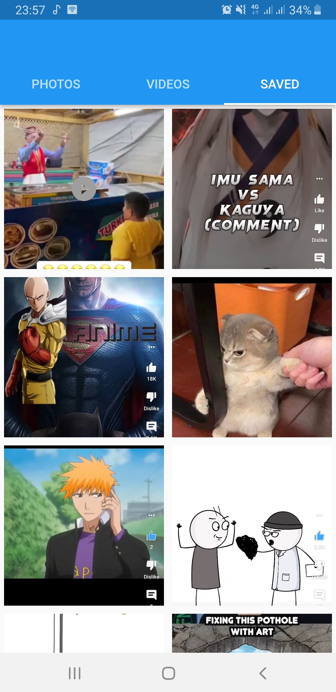
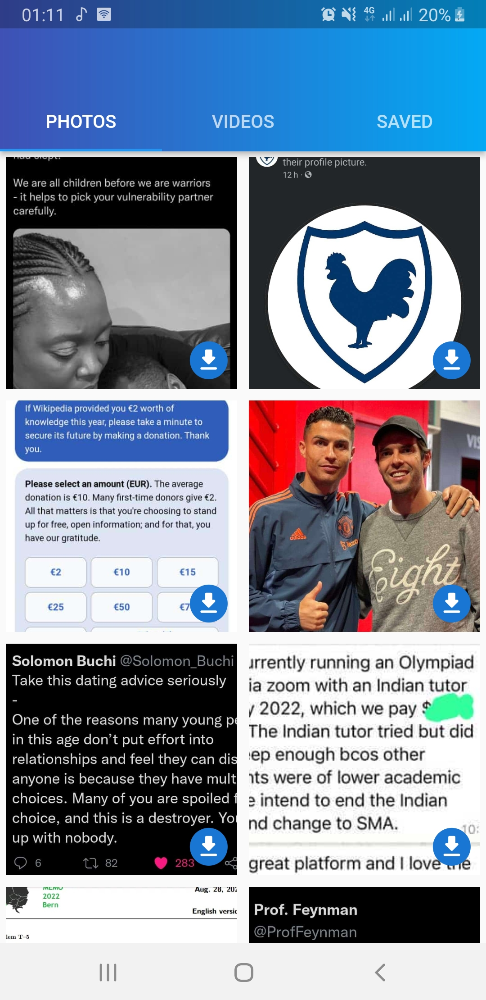
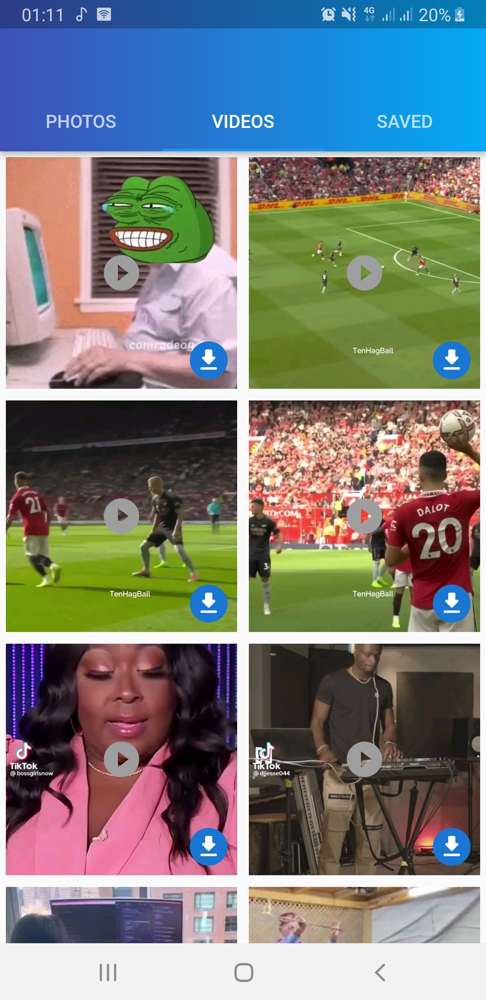
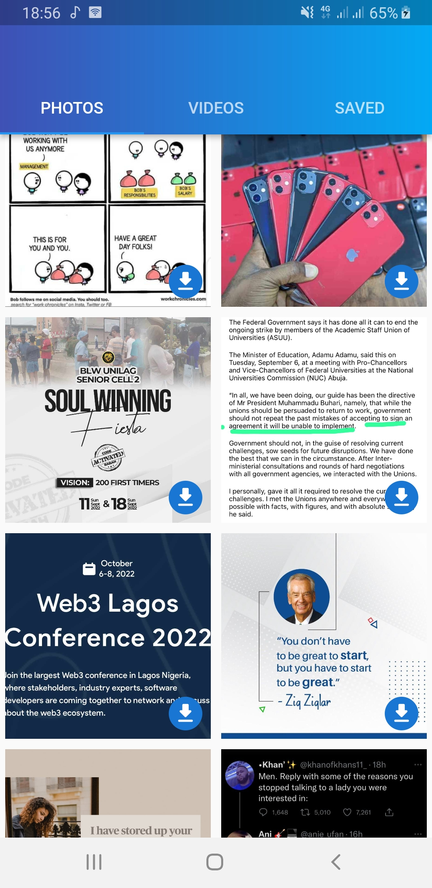

<h4>This is an application for viewing and downloading status from whatsapp</h4>

<h4><strong>FEATURES</strong></h4>
<ul>
<li>
View and download status in grid
</li>

<li>
Share status
</li>
<li>Watch video statuses with video player</li>

</ul>

<h4><strong>Steps to run/Requirements</strong></h4>
<ul>
<li>
Android device
  
</li>
  <li>
min sdk 22
  
</li>
   <li>
Clone project to system
  
</li>
   <li>
Open in application with integrated flutter support e.g Android studio, Visual Studio
  
</li>
   <li>Launch program on emulator or android device
  
</li>
  </ul>

<table>
<tr>
<td>

</td>

<td>

</td>

<td>

</td>

<td>

</td>

<td>

</td>

</tr>

</table>
